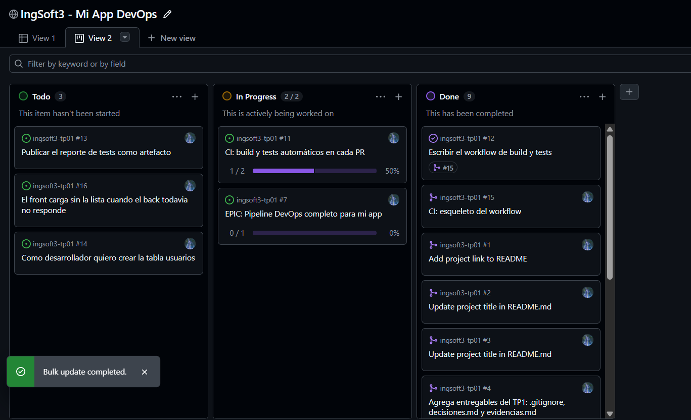

# Evidencias — TP1

Repositorio: https://github.com/ivanjalid1/ingsoft3-tp01

## 1. Push directo a `main` rechazado


GitHub rechaza el push con `GH006: Protected branch update failed` / `protected branch hook declined`.
La regla de protección exige que todo cambio entre por Pull Request y, como está activado
*Do not allow bypassing*, también me alcanza a mí que soy el dueño del repositorio.

## 2. El PR de la rama B no se puede mergear: conflicto


PR #3 (`feature/titulo-b` → `main`): GitHub avisa *"This branch has conflicts that must be resolved"*.
La rama A ya había entrado a `main` cambiando la misma línea del `README.md`, así que el merge
automático no es posible.

## 3. Los marcadores del conflicto


Editor web de resolución de conflictos: `<<<<<<< feature/titulo-b` (mi versión, la B),
`=======` (la frontera) y `>>>>>>> main` (lo que ya está en `main`, la versión A).
Resolví eligiendo el contenido final y borrando las tres líneas de marcadores.

## 4. Release `v1.0.0` publicada


Tag `v1.0.0` (semver) sobre `main` y release publicada con sus notas.

---

# Evidencias — TP2 (App contenerizada)

Todas las salidas de acá abajo son literales: las corrí en mi máquina (Windows 11,
Docker 29.4.3) sobre el árbol de `tp2/` tal como está en el repo, y las pegué sin
editar más que recortar el token JWT y el ruido del build.

## 1. Los tres contenedores levantados y healthy

Un solo comando levanta la base, el backend y el frontend. El `depends_on` con
`condition: service_healthy` hace que el backend no arranque hasta que MySQL
conteste el ping, así que el orden lo resuelve compose y no yo.

```
$ cd tp2
$ docker compose up -d --build
[... build de tp2-backend y tp2-frontend ...]
 Image tp2-backend Built
 Image tp2-frontend Built
 Network tp2_default Creating
 Network tp2_default Created
 Volume tp2_db_data Creating
 Volume tp2_db_data Created
 Container erp-db Creating
 Container erp-db Created
 Container erp-backend Creating
 Container erp-backend Created
 Container erp-frontend Creating
 Container erp-frontend Created
 Container erp-db Starting
 Container erp-db Started
 Container erp-db Waiting
 Container erp-db Healthy
 Container erp-backend Starting
 Container erp-backend Started
 Container erp-frontend Starting
 Container erp-frontend Started
```

De punta a punta tardó **33 segundos** (con la caché de build tibia). De esos, la
mayor parte se la lleva la base: el `Container erp-db Waiting` es el backend
esperando el healthcheck.

Estado de los tres servicios, con el `(healthy)` de la base y el único puerto
publicado hacia afuera:

```
$ docker compose ps
NAME           IMAGE          COMMAND                  SERVICE    CREATED          STATUS                    PORTS
erp-backend    tp2-backend    "docker-entrypoint.s…"   backend    34 seconds ago   Up 7 seconds              3000/tcp
erp-db         mysql:8        "docker-entrypoint.s…"   db         34 seconds ago   Up 33 seconds (healthy)   3306/tcp, 33060/tcp
erp-frontend   tp2-frontend   "/docker-entrypoint.…"   frontend   34 seconds ago   Up 6 seconds              0.0.0.0:8080->80/tcp, [::]:8080->80/tcp
```

Vale la pena mirar la columna `PORTS`: el backend expone `3000/tcp` y la base
`3306/tcp` **hacia la red interna de compose solamente**. El único mapeo al host
es `0.0.0.0:8080->80/tcp` del frontend. Todo el tráfico a la API entra por nginx.

Los últimos renglones de los logs confirman que la base terminó de inicializar y
que el backend levantó después:

```
$ docker compose logs db | tail -5
erp-db  | 2026-09-02T16:07:08.940733Z 0 [Warning] [MY-010068] [Server] CA certificate ca.pem is self signed.
erp-db  | 2026-09-02T16:07:08.940806Z 0 [System] [MY-013602] [Server] Channel mysql_main configured to support TLS. Encrypted connections are now supported for this channel.
erp-db  | 2026-09-02T16:07:08.950985Z 0 [Warning] [MY-011810] [Server] Insecure configuration for --pid-file: Location '/var/run/mysqld' in the path is accessible to all OS users. Consider choosing a different directory.
erp-db  | 2026-09-02T16:07:08.991481Z 0 [System] [MY-011323] [Server] X Plugin ready for connections. Bind-address: '::' port: 33060, socket: /var/run/mysqld/mysqlx.sock
erp-db  | 2026-09-02T16:07:08.991726Z 0 [System] [MY-010931] [Server] /usr/sbin/mysqld: ready for connections. Version: '8.4.11'  socket: '/var/run/mysqld/mysqld.sock'  port: 3306  MySQL Community Server - GPL.

$ docker compose logs backend | tail -10
erp-backend  | [server] escuchando en el puerto 3000
```

El backend loguea una sola línea, y eso es buena señal: si hubiera fallado la
conexión a MySQL, acá aparecería el error de `mysql2` en vez del `escuchando`.

## 2. Un arranque que falló de verdad: el volumen a medio inicializar

El primer intento de esta misma corrida **no levantó**. Lo dejo documentado
porque es el modo de falla más probable de reproducir y la salida explica sola
qué hacer:

```
 Container erp-db Waiting
 Container erp-db Error dependency db failed to start
dependency failed to start: container erp-db is unhealthy
```

El log de la base dice exactamente por qué:

```
$ docker compose logs db | tail -6
erp-db  | 2026-09-02 16:06:18+00:00 [Note] [Entrypoint]: Initializing database files
erp-db  | 2026-09-02T16:06:18.711109Z 0 [System] [MY-015017] [Server] MySQL Server Initialization - start.
erp-db  | 2026-09-02T16:06:18.714452Z 0 [ERROR] [MY-010457] [Server] --initialize specified but the data directory has files in it. Aborting.
erp-db  | 2026-09-02T16:06:18.714456Z 0 [ERROR] [MY-013236] [Server] The designated data directory /var/lib/mysql/ is unusable. You can remove all files that the server added to it.
erp-db  | 2026-09-02T16:06:18.714528Z 0 [ERROR] [MY-010119] [Server] Aborting
erp-db  | 2026-09-02T16:06:18.714884Z 0 [System] [MY-015018] [Server] MySQL Server Initialization - end.
```

Había un `tp2_db_data` de una corrida anterior que había quedado a mitad de la
inicialización: con archivos adentro, pero sin la base terminada. MySQL ve el
directorio no vacío, se niega a re-inicializar y aborta; como `restart:
unless-stopped` lo vuelve a levantar, entra en loop de `Restarting (1)` y nunca
llega a healthy. La solución es tirar el volumen, no tocar el compose:

```
$ docker compose down -v
 Volume tp2_db_data Removing
 Volume tp2_db_data Removed
```

Después de eso, el `up` de la sección 1 anduvo a la primera. Es un argumento más
a favor de `down -v` como forma normal de cerrar: el estado de la base vive en un
volumen, y un volumen a medio hacer es peor que ninguno.

## 3. Tamaños de las imágenes y el multi-stage

Estos son los tamaños reales de las dos imágenes que construye el compose, con
las bases al lado para poder comparar:

```
$ docker images --format 'table {{.Repository}}\t{{.Tag}}\t{{.Size}}'
REPOSITORY                              TAG                      SIZE
tp2-frontend                            latest                   93.4MB
tp2-backend                             latest                   213MB
mysql                                   8                        1.12GB
nginx                                   alpine                   93.6MB
node                                    20-alpine                194MB
```

La comparación que justifica el multi-stage del frontend está en esas cuatro
líneas. El frontend se construye en `node:20-alpine` — **194 MB de base**, más
los 176 paquetes que instala `npm ci`, más el código fuente — y de todo eso la
imagen final se queda únicamente con el `dist/` de Vite copiado sobre
`nginx:alpine`. El resultado, **93.4 MB**, es prácticamente la base de nginx sola
(93.6 MB): el bundle que produce Vite son 183 kB de JS más 10 kB de CSS más las
fuentes, unos pocos MB en total. Node, `node_modules` y el código fuente no
viajan a producción, que es exactamente lo que el patrón busca.

El backend, en cambio, sí necesita Node en runtime, así que se queda en **213 MB**:
la base `node:20-alpine` más los 95 paquetes de producción (`npm ci --omit=dev`).
Ahí el multi-stage no compraría casi nada, y por eso el Dockerfile del backend es
de una sola etapa.

## 4. La app responde y el login funciona

nginx sirve el `index.html` del build de Vite en el puerto 8080 del host:

```
$ curl -i http://localhost:8080
HTTP/1.1 200 OK
Server: nginx/1.31.3
Date: Wed, 02 Sep 2026 16:07:36 GMT
Content-Type: text/html
Content-Length: 408
Last-Modified: Wed, 02 Sep 2026 16:06:09 GMT
Connection: keep-alive
ETag: "6a984971-198"
Accept-Ranges: bytes

<!doctype html>
<html lang="es">
  <head>
    <meta charset="UTF-8" />
    <meta name="viewport" content="width=device-width, initial-scale=1.0" />
    <title>ERP mínimo</title>
    <script type="module" crossorigin src="/assets/index-Cq3h7jUN.js"></script>
    <link rel="stylesheet" crossorigin href="/assets/index-DSxAWBLV.css">
  </head>
```

El healthcheck del backend está en `/health`, fuera de `/api` a propósito para
que no le pegue el middleware de token. Como el backend no publica puerto al
host, lo consulto desde adentro de la red de compose:

```
$ docker compose exec -T frontend wget -qO- http://backend:3000/health
{"status":"ok"}
```

El login por API entra por el mismo origen que el front (`/api/auth/login`, que
nginx reenvía a `backend:3000`), con el usuario que siembra `init.sql`. Recorto
el token a los primeros 12 caracteres:

```
$ curl -i -X POST http://localhost:8080/api/auth/login \
    -H "Content-Type: application/json" \
    -d '{"email":"admin@erp.local","password":"Admin123!"}'
HTTP/1.1 200 OK
Server: nginx/1.31.3
Content-Type: application/json; charset=utf-8
Content-Length: 230
X-Powered-By: Express

{"token":"eyJhbGciOiJI...","usuario":{"id":1,"email":"admin@erp.local"}}
```

Que el login devuelva 200 prueba las tres piezas encadenadas: el navegador pega
en nginx, nginx proxea al backend, y el backend consulta MySQL y encuentra al
usuario semilla. Para cerrar el circuito, el mismo token abre un endpoint
protegido y sin él la API responde 401:

```
$ curl -i http://localhost:8080/api/productos -H "Authorization: Bearer $TOKEN"
HTTP/1.1 200 OK
Content-Type: application/json; charset=utf-8

[{"id":2,"nombre":"Monitor","precio":180000,"stock":5,"activo":true},{"id":1,"nombre":"Teclado","precio":15000,"stock":20,"activo":true}]

$ curl -i http://localhost:8080/api/productos
HTTP/1.1 401 Unauthorized
Content-Type: application/json; charset=utf-8

{"error":{"code":"TOKEN_FALTANTE","message":"Falta el header Authorization: Bearer <token>"}}
```

Los productos que devuelve son los de `init.sql`, así que además queda probado
que el script de inicialización corrió dentro del contenedor de la base.

## 5. El healthcheck de la base, con `-h 127.0.0.1`

Este es el comando exacto que corre el healthcheck del compose, ejecutado a mano
contra el contenedor:

```
$ docker compose exec -T db mysqladmin ping -h 127.0.0.1 -uroot -prootpass
mysqladmin: [Warning] Using a password on the command line interface can be insecure.
mysqld is alive
```

El `-h 127.0.0.1` no es decorativo: fuerza TCP. Con `-h localhost`, `mysqladmin`
resuelve por socket UNIX, y durante la inicialización la imagen `mysql:8` levanta
un servidor temporal con `--skip-networking` para correr los scripts de
`/docker-entrypoint-initdb.d/`. Ese servidor temporal contesta el ping por
socket, así que compose marcaba la base como healthy **antes** de que el 3306
real estuviera escuchando, y el backend arrancaba contra una base que todavía no
existía. Por TCP el ping recién contesta cuando el servidor definitivo escucha,
que es justo la condición que el `depends_on` necesita.

La evidencia de que ahora sí espera lo correcto está en los timestamps: la base
arrancó a las `16:06:44.98`, terminó de inicializar (`ready for connections`) a
las `16:07:08.99` y el backend recién arrancó a las `16:07:11.42`. O sea, el
backend esperó los ~26 segundos que la base tardó en estar realmente disponible.

Una nota al margen: el tag `mysql:8` hoy resuelve a **8.4.11**, no a un 8.0. El
compose fija la línea mayor, no la menor.

## 6. Los tests pasando

Backend — `vitest` sobre la lógica de negocio y validación:

```
$ cd tp2/backend && npm ci && npm test

> erp-backend@1.0.0 test
> vitest run

 RUN  v2.1.9 C:/Users/ADMIN/ingsoft3/tp2/backend

 ✓ tests/productos.test.js (7 tests) 104ms
 ✓ tests/clientes.test.js (11 tests) 138ms
 ✓ tests/env.test.js (5 tests) 194ms
 ✓ tests/ventas.test.js (27 tests) 266ms
 ✓ tests/auth.test.js (6 tests) 265ms

 Test Files  5 passed (5)
      Tests  56 passed (56)
   Duration  2.21s
```

Frontend — `vitest` + Testing Library sobre las pantallas:

```
$ cd tp2/frontend && npm ci && npm test

 ✓ tests/rutaProtegida.test.jsx (2 tests) 193ms
 ✓ tests/nuevaVenta.test.jsx (3 tests) 1106ms
 ✓ tests/clientes.test.jsx (3 tests) 1699ms
 ✓ tests/productos.test.jsx (4 tests) 1681ms

 Test Files  6 passed (6)
      Tests  15 passed (15)
   Duration  5.45s
```

**56 + 15 = 71 tests, todos en verde.** El número coincide con el que declara
`decisiones.md`. La única salida ruidosa son los *future flag warnings* de React
Router v6 avisando cambios de v7; no fallan nada.

## 7. Las imágenes publicadas se bajan de ghcr.io sin autenticar

Para que la prueba valga algo, primero cierro sesión en el registry y borro las
copias locales. Si quedara alguna credencial guardada, el `pull` no probaría que
los paquetes son públicos:

```
$ docker logout ghcr.io
Removing login credentials for ghcr.io

$ docker rmi ghcr.io/ivanjalid1/erp-backend:v0.1.0 ghcr.io/ivanjalid1/erp-frontend:v0.1.0
Untagged: ghcr.io/ivanjalid1/erp-backend:v0.1.0
Deleted: sha256:e953d01c67c9f0dc9b03515663a311a2ce89ac594a6fb9edaa4191536b8604df
Untagged: ghcr.io/ivanjalid1/erp-frontend:v0.1.0
Deleted: sha256:e52551bf22a9bd50763d852e7f0973527d49ac256508c213cdf9bef9e93d61f3
```

Y ahora el pull, ya sin credenciales:

```
$ docker pull ghcr.io/ivanjalid1/erp-backend:v0.1.0
v0.1.0: Pulling from ivanjalid1/erp-backend
ca6021f888c8: Pull complete
4f4fb700ef54: Pull complete
9726ce6e2e33: Pull complete
000f83b03724: Pull complete
7fbc4fd67dc2: Pull complete
Digest: sha256:e953d01c67c9f0dc9b03515663a311a2ce89ac594a6fb9edaa4191536b8604df
Status: Downloaded newer image for ghcr.io/ivanjalid1/erp-backend:v0.1.0

$ docker pull ghcr.io/ivanjalid1/erp-frontend:v0.1.0
v0.1.0: Pulling from ivanjalid1/erp-frontend
369c3553be31: Pull complete
fc182fbe317f: Pull complete
Digest: sha256:e52551bf22a9bd50763d852e7f0973527d49ac256508c213cdf9bef9e93d61f3
Status: Downloaded newer image for ghcr.io/ivanjalid1/erp-frontend:v0.1.0
```

Los digests coinciden con los que borré, así que bajé exactamente las mismas
imágenes. Tamaños publicados:

```
$ docker images --format 'table {{.Repository}}\t{{.Tag}}\t{{.Size}}' | grep erp-
ghcr.io/ivanjalid1/erp-frontend         v0.1.0                   93.4MB
ghcr.io/ivanjalid1/erp-backend          v0.1.0                   212MB
```

Con esas imágenes, `docker-compose.registry.yml` levanta el stack sin compilar
nada. Es el caso de uso real del registry: alguien que clona el repo — o que ni
siquiera lo clona, solo tiene el compose — corre la app sin tener Node ni el
código fuente.

```
$ docker compose -f docker-compose.registry.yml up -d
 Container erp-db Waiting
 Container erp-db Healthy
 Container erp-backend Started
 Container erp-frontend Started

$ docker compose -f docker-compose.registry.yml ps
NAME           IMAGE                                    COMMAND                  SERVICE    STATUS
erp-backend    ghcr.io/ivanjalid1/erp-backend:v0.1.0    "docker-entrypoint.s…"   backend    Up 1 second
erp-db         mysql:8                                  "docker-entrypoint.s…"   db         Up 28 seconds (healthy)
erp-frontend   ghcr.io/ivanjalid1/erp-frontend:v0.1.0   "/docker-entrypoint.…"   frontend   Up 1 second
```

Y la app publicada responde igual que la construida a mano:

```
$ curl -s -o /dev/null -w "GET / -> HTTP %{http_code}\n" http://localhost:8080
GET / -> HTTP 200

$ curl -s -X POST http://localhost:8080/api/auth/login \
    -H "Content-Type: application/json" \
    -d '{"email":"admin@erp.local","password":"Admin123!"}'
{"token":"eyJhbGciOiJI...","usuario":{"id":1,"email":"admin@erp.local"}}
```

Al terminar, bajo todo y me llevo puesto el volumen para no dejar estado colgado:

```
$ docker compose -f docker-compose.registry.yml down -v
 Container erp-db Removed
 Volume tp2_db_data Removed
 Network tp2_default Removed
```

---

# Evidencias — TP3 (Planificación y trazabilidad)

Las salidas de esta sección son literales: las saqué con `gh` contra el repo y el
Project reales, y las pegué sin editar más que alinear alguna columna. El Project
es https://github.com/users/ivanjalid1/projects/1.

## 1. El Project es público y el sprint dura una semana

Lo primero que hay que poder verificar desde afuera es que el tablero se ve sin
estar logueado. El campo `public` del Project lo dice sin ambigüedad, y de paso
quedan a la vista los 14 ítems que tiene cargados:

```
$ gh project view 1 --owner "@me" --format json --jq '{title, public, url, items: .items.totalCount}'
{"items":14,"public":true,"title":"IngSoft3 - Mi App DevOps","url":"https://github.com/users/ivanjalid1/projects/1"}
```

La configuración del sprint vive en el campo de iteración `Sprint`, que la API de
Projects solo expone por GraphQL:

```
$ gh api graphql -f query='
query {
  user(login: "ivanjalid1") {
    projectV2(number: 1) {
      title
      public
      field(name: "Sprint") {
        ... on ProjectV2IterationField {
          name
          configuration {
            duration
            startDay
            iterations { title startDate duration }
          }
        }
      }
    }
  }
}'
{"data":{"user":{"projectV2":{"title":"IngSoft3 - Mi App DevOps","public":true,"field":{"name":"Sprint","configuration":{"duration":14,"startDay":4,"iterations":[{"title":"Sprint 1","startDate":"2026-08-27","duration":7}]}}}}}}
```

Hay que leer esa salida con cuidado porque trae **dos** `duration` y significan
cosas distintas. El de afuera (`"duration":14`) es el valor por defecto que
GitHub usaría para generar la *próxima* iteración; quedó en 14 porque es lo que
trae de fábrica y nunca lo toqué. El que importa es el de adentro del array
`iterations`: **`Sprint 1`, `startDate` `2026-08-27`, `duration` 7**. Esa es la
iteración que existe de verdad y en la que están cargados los ítems, y son
efectivamente 7 días — la decisión de "un sprint de 1 semana" que justifico en
`decisiones.md` §TP3.1 (*"Elegí un sprint de 1 semana"*). Con inicio el
2026-08-27, el sprint cierra el 2026-09-03.

El release del TP3 cae dentro de esa ventana, que es lo que uno esperaría si el
sprint es real y no una etiqueta puesta después:

```
$ gh release list
TP3 - Planificacion y trazabilidad	Latest	v3.0.0	2026-08-27T20:00:00Z
TP2 - App contenerizada			v2.0.0	2026-08-27T19:24:53Z
v1.0.0					v1.0.0	2026-08-12T18:19:07Z
```

`v3.0.0` se publicó el 2026-08-27 a las 20:00 UTC: el mismo día en que arranca
`Sprint 1`, unos minutos después de que terminara de cargar el tablero.

## 2. El límite de trabajo en progreso (WIP)

El límite de WIP es una configuración de la vista del board y la API de Projects
no la expone, así que la evidencia acá es la captura del tablero:



Lo que hay que mirar es el contador al lado del nombre de cada columna. `Todo`
dice `3` y `Done` dice `9` — un número solo, sin límite. `In Progress`, en
cambio, dice **`2 / 2`**: el primer número son las tarjetas que hay adentro
(#11 y #7) y el segundo es el tope configurado. Está en 2 porque es la regla de
arranque del enunciado que aplico en `decisiones.md` §TP3.2 — cantidad de
personas + 1, y trabajando solo eso da 2. La columna está justo en el límite, así
que para meter una tercera tarjeta tendría que sacar una primero: exactamente el
efecto que el límite busca.

La captura también muestra dos cosas que sirven para el resto de la sección: el
ícono de globo al lado del título confirma que el Project es público, y la
tarjeta de #12 en `Done` lleva colgado el chip `#15`, que es el PR que la cerró.

## 3. La jerarquía épica → historia → tareas

Estos son todos los issues del repo, con el label que marca de qué nivel es cada
uno:

```
$ gh issue list --state all --json number,title,state,labels \
    --jq '.[] | "\(.number)\t\(.state)\t[\(.labels|map(.name)|join(","))]\t\(.title)"'
16	OPEN	[bug]	El front carga sin la lista cuando el back todavia no responde
14	OPEN	[]	Como desarrollador quiero crear la tabla usuarios
13	OPEN	[task]	Publicar el reporte de tests como artefacto
12	CLOSED	[task]	Escribir el workflow de build y tests
11	OPEN	[story]	CI: build y tests automáticos en cada PR
7	OPEN	[epic]	EPIC: Pipeline DevOps completo para mi app
```

Los labels (`epic`, `story`, `task`, `bug`) dicen qué es cada issue, pero no
prueban que estén *colgados* unos de otros. Eso lo prueba la relación de
sub-issues, que es una relación real de GitHub y no una convención de nombres:

```
$ gh api graphql -f query='
query {
  repository(owner: "ivanjalid1", name: "ingsoft3-tp01") {
    issue(number: 7) {
      number title
      subIssues(first: 10) {
        totalCount
        nodes { number title state
          subIssues(first: 10) { totalCount nodes { number title state } }
        }
      }
    }
  }
}'
{"data":{"repository":{"issue":{"number":7,"title":"EPIC: Pipeline DevOps completo para mi app","subIssues":{"totalCount":1,"nodes":[{"number":11,"title":"CI: build y tests automáticos en cada PR","state":"OPEN","subIssues":{"totalCount":2,"nodes":[{"number":13,"title":"Publicar el reporte de tests como artefacto","state":"OPEN"},{"number":12,"title":"Escribir el workflow de build y tests","state":"CLOSED"}]}}]}}}}}
```

La consulta arranca en la épica y baja dos niveles sola, que es la forma de ver
la cadena completa de una sola vez:

- **#7** (`epic`) → *EPIC: Pipeline DevOps completo para mi app*
  - **#11** (`story`) → *CI: build y tests automáticos en cada PR*
    - **#12** (`task`, `CLOSED`) → *Escribir el workflow de build y tests*
    - **#13** (`task`, `OPEN`) → *Publicar el reporte de tests como artefacto*

Los dos issues que quedan afuera de esa cadena están afuera a propósito. **#16**
es el bug (`[bug]`), que no cuelga de la historia porque no es trabajo
planificado sino algo que apareció; va al costado, en `Todo`. Y **#14** es la
historia mal escrita del ejercicio ("Como desarrollador quiero crear la tabla
usuarios"), que dejé suelta justamente porque el punto del ejercicio es que *no*
es una historia: el diagnóstico y la reescritura están en `decisiones.md` §TP3.3.

Una aclaración sobre esa última fila: #14 aparece con la lista de labels
**vacía** (`[]`). No es un error de la consulta, es que nunca le puse label. Y
tiene sentido que no lo tenga: ponerle `story` sería afirmar que es una historia,
que es precisamente lo que el ejercicio pide discutir.

## 4. El contenido del Sprint 1

Estos son los ítems que tienen la iteración `Sprint 1` asignada, con su columna
del board:

```
$ gh project item-list 1 --owner "@me" --limit 30 --format json \
    --jq '.items[] | select(.sprint != null) | "\(.content.type)\t#\(.content.number)\t\(.status)\t\(.sprint.title)\t\(.title)"'
Issue		#13	Todo		Sprint 1	Publicar el reporte de tests como artefacto
Issue		#11	In Progress	Sprint 1	CI: build y tests automáticos en cada PR
Issue		#7	In Progress	Sprint 1	EPIC: Pipeline DevOps completo para mi app
Issue		#12	Done		Sprint 1	Escribir el workflow de build y tests
PullRequest	#15	Done		Sprint 1	CI: esqueleto del workflow
Issue		#16	Todo		Sprint 1	El front carga sin la lista cuando el back todavia no responde
Issue		#14	Todo		Sprint 1	Como desarrollador quiero crear la tabla usuarios
```

Son 7 ítems: la épica, la historia, sus dos tareas, el PR, el bug y la historia
del ejercicio. Los estados coinciden uno a uno con los contadores de la captura
de la sección 2 — dos `In Progress` (#11 y #7, que es el `2 / 2`), tres `Todo`
(#13, #16 y #14, que es el `3`) y dos `Done` (#12 y #15).

El Project tiene 14 ítems pero solo 7 están en el sprint. Los otros 7 son PRs
viejos:

```
$ gh project item-list 1 --owner "@me" --limit 30 --format json \
    --jq '.items[] | select(.sprint == null) | "\(.content.type)\t#\(.content.number)\t\(.status)\t(sin sprint)\t\(.title)"'
PullRequest	#1	Done	(sin sprint)	Add project link to README
PullRequest	#2	Done	(sin sprint)	Update project title in README.md
PullRequest	#3	Done	(sin sprint)	Update project title in README.md
PullRequest	#4	Done	(sin sprint)	Agrega entregables del TP1: .gitignore, decisiones.md y evidencias.md
PullRequest	#5	Done	(sin sprint)	feat: app del semestre - ERP minimo con sus tres contenedores
PullRequest	#6	Done	(sin sprint)	docs: quita el contenido de entrega y conserva la declaracion de uso de IA
PullRequest	#17	Done	(sin sprint)	docs: decisiones del TP3
```

Los dejé sin iteración a propósito. Son los PRs del TP1 y del TP2 más el del TP3,
todos mergeados *antes* de que `Sprint 1` existiera: meterlos adentro inflaría el
sprint con trabajo que no se hizo en esa ventana y haría que cualquier métrica de
la iteración mintiera. Están en el Project porque GitHub los agrega solo y son
parte de la historia del repo, pero no son parte del sprint.

## 5. Trazabilidad: tarea → PR → cierre automático

La cadena que quiero poder demostrar es que una tarea del sprint se cerró sola
cuando se mergeó el PR que la implementaba, sin que yo tocara el issue a mano.

El PR #15 declara la relación en el cuerpo con la palabra clave `Closes`:

```
$ gh pr view 15 --json number,title,mergedAt,body
{"body":"Agrega .github/workflows/ci.yml con el disparador y el checkout. Closes #12.","mergedAt":"2026-08-27T19:35:06Z","number":15,"title":"CI: esqueleto del workflow"}
```

Pero el texto del cuerpo por sí solo no prueba nada — podría estar mal escrito y
GitHub ignorarlo. Lo que prueba que GitHub *interpretó* la palabra clave es el
campo `closingIssuesReferences`, que es la relación ya parseada:

```
$ gh pr view 15 --json number,state,closingIssuesReferences
{"closingIssuesReferences":[{"id":"I_kwDOT2lG1M8AAAABOi7-mw","number":12,"repository":{"id":"R_kgDOT2lG1A","name":"ingsoft3-tp01","owner":{"id":"U_kgDOCcRTnQ","login":"ivanjalid1"}},"url":"https://github.com/ivanjalid1/ingsoft3-tp01/issues/12"}],"number":15,"state":"MERGED"}
```

Del otro lado, el issue #12 quedó cerrado y —esto es lo importante— cerrado como
**completado**, no como descartado:

```
$ gh issue view 12 --json number,title,state,stateReason,closed,closedAt
{"closed":true,"closedAt":"2026-08-27T19:35:07Z","number":12,"state":"CLOSED","stateReason":"COMPLETED","title":"Escribir el workflow de build y tests"}
```

La distinción entre `COMPLETED` y `NOT_PLANNED` no es un detalle: un issue
cerrado a mano y descartado también daría `state: CLOSED`, y para una métrica de
sprint no es lo mismo una tarea terminada que una abandonada.

Lo que cierra el círculo es el evento de cierre del timeline, porque nombra
explícitamente **quién** cerró el issue:

```
$ gh api graphql -f query='
query {
  repository(owner: "ivanjalid1", name: "ingsoft3-tp01") {
    issue(number: 12) {
      timelineItems(last: 5, itemTypes: [CLOSED_EVENT, CONNECTED_EVENT, CROSS_REFERENCED_EVENT]) {
        nodes {
          __typename
          ... on ClosedEvent {
            createdAt
            stateReason
            closer { __typename ... on PullRequest { number title mergedAt } }
          }
        }
      }
    }
  }
}'
{"data":{"repository":{"issue":{"timelineItems":{"nodes":[{"__typename":"CrossReferencedEvent"},{"__typename":"ClosedEvent","createdAt":"2026-08-27T19:35:07Z","stateReason":"COMPLETED","closer":{"__typename":"PullRequest","number":15,"title":"CI: esqueleto del workflow","mergedAt":"2026-08-27T19:35:06Z"}}]}}}}}
```

El `closer` del `ClosedEvent` es el PR #15. Y los timestamps lo confirman solos:
el PR se mergeó a las `19:35:06Z` y el issue se cerró a las `19:35:07Z`, **un
segundo después**. Ese segundo es GitHub procesando el merge; ninguna persona
cierra un issue un segundo después de apretar *Merge*.

La cadena completa queda entonces así, y cada eslabón tiene su comando arriba:

**épica #7** → **historia #11** → **tarea #12** → **PR #15** (`Closes #12`) →
merge → **#12 cerrado como `COMPLETED`** → la tarjeta pasa a `Done` en el board.
