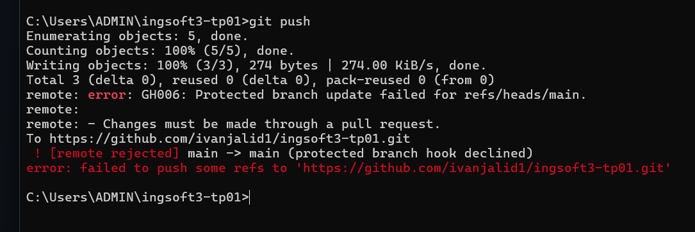
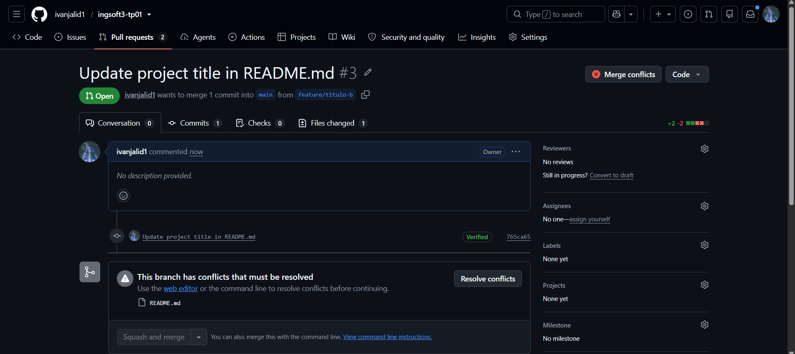
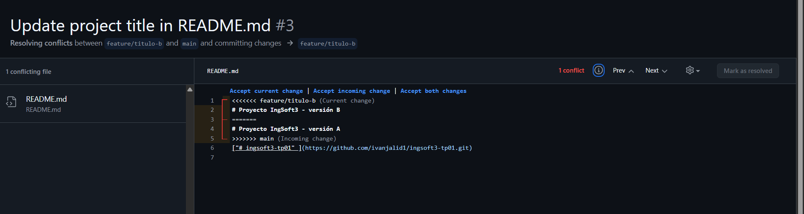
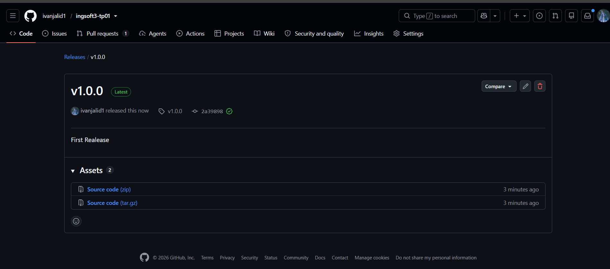

# Evidencias — TP1

Repositorio: https://github.com/ivanjalid1/ingsoft3-tp01

## 1. Push directo a `main` rechazado

GitHub rechaza el push con `GH006: Protected branch update failed` / `protected branch hook declined`.
La regla de protección exige que todo cambio entre por Pull Request y, como está activado
*Do not allow bypassing*, también me alcanza a mí que soy el dueño del repositorio.

## 2. El PR de la rama B no se puede mergear: conflicto

PR #3 (`feature/titulo-b` → `main`): GitHub avisa *"This branch has conflicts that must be resolved"*.
La rama A ya había entrado a `main` cambiando la misma línea del `README.md`, así que el merge
automático no es posible.

## 3. Los marcadores del conflicto

Editor web de resolución de conflictos: `<<<<<<< feature/titulo-b` (mi versión, la B),
`=======` (la frontera) y `>>>>>>> main` (lo que ya está en `main`, la versión A).
Resolví eligiendo el contenido final y borrando las tres líneas de marcadores.

## 4. Release `v1.0.0` publicada

Tag `v1.0.0` (semver) sobre `main` y release publicada con sus notas.
